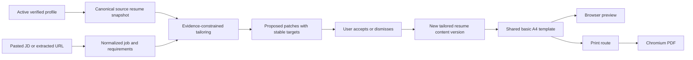

# Tailor Page: Product and UX Research

Date: 2026-07-30  
Status: Research recommendation, not an approved implementation specification  
Scope: Resume tailoring from a pasted job description or job URL, reviewable changes, one A4 template, and PDF download

## Executive recommendation

Build Tailor as a two-stage workflow:

1. A compact job-input state where the user chooses **Job URL** or **Paste description**, confirms the extracted job, and starts tailoring.
2. A persistent desktop review workspace with **changes and keyword insights on the left** and a **real paginated A4 resume on the right**.

The resume preview must not be a visual approximation. Store one canonical structured tailored-resume document, render it through one template component, and use that same component in:

- the browser preview;
- a dedicated print route; and
- the headless Chromium PDF export.

This is the smallest architecture that satisfies “what I review is what I download.” It also fits the application’s existing evidence-preserving direction: AI proposes edits, the user accepts or rejects them, and accepted content must remain traceable to verified profile facts.

Do not make the first version a free-form resume builder. Do not add multiple templates, cover-letter work, inline rich-text formatting, arbitrary section creation, or DOCX export yet.

## What exists in this repository

The Tailor page already contains an early prototype rather than a blank screen.

### Existing frontend flow

`webapp/src/pages/tailor.tsx` currently provides:

- an initial form with optional role title and company fields;
- a pasted job-description textarea;
- a call to job analysis followed by tailoring and match scoring;
- proposed change cards with accept, reject, and undo controls;
- classifications such as rephrased, reordered, emphasized, removed, and new claim;
- a right-side element with an A4 aspect ratio; and
- a final “Approve & Submit” action that creates a tracked application.

### Existing backend flow

The backend already:

- analyzes a pasted job description into a saved job and requirements;
- loads only current, verified profile facts;
- asks the configured AI provider for structured resume changes;
- filters returned source fact IDs against valid verified facts;
- persists generated documents and individual proposed changes; and
- persists accept/reject review state.

### Important gaps

The prototype does not yet:

- accept or extract a job URL;
- hold a complete structured resume document;
- map each proposed edit to a stable section/item/bullet identifier;
- reconstruct the full original resume;
- apply accepted edits to a canonical tailored resume;
- show added and removed keywords separately from sentence-level edits;
- paginate actual content into A4 pages;
- detect page overflow or orphaned section headings;
- expose a PDF generation or download endpoint;
- guarantee browser/PDF font and layout parity; or
- separate “save tailored resume” from “track application.”

The current preview renders only accepted change fragments. It therefore cannot become a correct PDF merely by adding a download button.

## Product principles

### 1. Truth before match score

The system may rephrase, reorder, emphasize, or remove verified information. It must not invent employers, skills, metrics, dates, responsibilities, or achievements.

`NEW_CLAIM` is dangerous wording in the current contract. In the first production version, treat an unsupported new claim as a blocked change, not as an ordinary green “added” change. A keyword can be added only when the underlying capability is supported by verified profile evidence.

### 2. Review changes in context

Users should not review isolated AI sentences without seeing where they land in the resume. Selecting a change card should scroll the A4 preview to the affected content and briefly emphasize it.

### 3. Keywords are signals, not content instructions

Show:

- **Covered**: important job keywords already supported by the resume;
- **Added**: supported keywords introduced through an accepted change;
- **Removed**: words or phrases removed from the original resume;
- **Missing**: important job keywords with no verified supporting evidence.

Never encourage the user to insert a missing keyword without evidence.

### 4. One source of rendering truth

The preview and export must consume the same resume data, template markup, CSS tokens, fonts, page size, and margins. A screenshot-like preview plus a separately generated PDF is not acceptable.

### 5. Make the next action obvious

The primary action changes with state:

- before analysis: **Analyze job**
- after job extraction: **Tailor resume**
- during review: **Download PDF**

“Approve & Submit” should not be the primary action because downloading a tailored resume does not mean the user submitted an application.

## Reference-product findings

### Resume-Matcher

[Resume-Matcher](https://github.com/srbhr/Resume-Matcher) uses a master-resume-first workflow:

1. upload a master PDF or DOCX;
2. paste a job description;
3. review AI improvements;
4. customize the document; and
5. export a PDF.

Useful ideas to borrow:

- a single, focused job-description entry step;
- clear readiness gates when a resume or AI provider is unavailable;
- a change summary before saving AI output;
- resume scoring and keyword highlighting;
- an explicit master-resume versus tailored-resume relationship; and
- headless Chromium/Playwright for PDF output.

Ideas not to copy directly:

- a large modal as the main detailed-change review surface;
- a separate builder destination before the user understands the result;
- dense template and formatting controls in the first release; and
- its high-contrast Swiss visual language, which does not match this application.

The strongest transferable lesson is its workflow hierarchy, not its styling.

### TailorTom

[TailorTom](https://www.tailortom.org/) keeps line counts and layout constraints in the optimization loop, recompiles after changes, and shows side-by-side PDF comparison with word-level diffs.

Useful lesson: layout validity is part of tailoring quality. A semantically better bullet is not acceptable if it unexpectedly creates an extra page or breaks the document.

Not recommended for this app’s first version: exposing LaTeX or a source-code editor. The current product is profile/fact driven and should keep the document model structured.

### Resume Tailor

[Resume Tailor](https://www.tailoredresume.dev/) describes a simple source → JD → generate/review/export flow, keyword coverage, and an A4 preview.

Useful lesson: the workflow should feel repeatable for every job. Avoid a complex wizard once the user already has an active resume profile.

### CV ATS Tailor

[CV ATS Tailor](https://www.cvatstailor.com/) places the generated PDF preview on the same page before download.

Useful lesson: PDF download should follow visual verification, not happen invisibly after generation.

### Other patterns observed

- Products such as [Rezumi](https://www.rezumi.ai/) separate writing/ATS analysis from design/export.
- [Forte](https://forteresume.com/) emphasizes a before/after match score and a diff of every change.
- Live resume builders commonly use a dual-pane editor and preview, but full editing would expand this first release beyond its core purpose.

## Three UX approaches

### Approach A: Sequential wizard

Flow:

1. add job;
2. inspect analysis;
3. review changes;
4. preview;
5. download.

Advantages:

- easy to understand on small screens;
- each screen has one task; and
- simpler initial implementation.

Disadvantages:

- hides the relationship between an accepted edit and its layout effect;
- causes repeated forward/back navigation; and
- makes visual overflow easy to miss.

Verdict: suitable for mobile adaptation, not the preferred desktop experience.

### Approach B: Three-column studio

Layout:

- job and keyword analysis;
- change review;
- A4 preview.

Advantages:

- maximum simultaneous context;
- resembles professional document tools; and
- makes the full workflow visible.

Disadvantages:

- too cramped inside the application sidebar at ordinary laptop widths;
- encourages very narrow change cards;
- produces complex nested scrolling; and
- is difficult to adapt cleanly below approximately 1440 px.

Verdict: attractive in a mockup, but too dense for this application.

### Approach C: Two-pane review workspace — recommended

Layout:

- left pane: job summary, score/keyword tabs, and reviewable changes;
- right pane: sticky paginated A4 resume and export controls.

Advantages:

- preserves direct change-to-document context;
- fits the app’s existing page shell;
- leaves enough width for a readable A4 page;
- supports a clear sticky download action; and
- can collapse into a sequential experience on narrower screens.

Disadvantages:

- the left pane needs careful hierarchy to avoid a long wall of cards;
- the preview needs zoom and page navigation; and
- accepting a change may trigger repagination.

Verdict: best balance of clarity, fidelity, and first-version scope.

## Recommended information architecture

### State 0: profile or AI setup gate

If no active resume profile exists:

- title: **Create your resume profile first**
- explanation: Tailor uses the verified experience and skills from My Resume.
- action: **Go to My Resume**

If no usable AI provider is configured:

- show the existing application-level unavailable banner/pattern;
- keep the page readable; and
- direct the user to Settings.

### State 1: job input

Page title: **Tailor resume**

Supporting copy: **Add a job description. We’ll suggest evidence-backed changes and show exactly what changed before you download.**

Job source uses two tabs:

- **Job URL**
- **Paste description**

Job URL tab:

- one URL input;
- example placeholder;
- **Fetch job** action;
- extraction progress;
- fallback to pasted text when the page is blocked, requires login, is expired, or lacks useful content.

Paste description tab:

- a document-style job-description text editor, not a compact textarea;
- a comfortable default editing height of approximately 50–65% of the available page viewport;
- preserved paragraphs, headings, and list breaks when content is pasted;
- plain-text storage and analysis even if the editor visually represents headings and lists;
- find-in-description and expand/full-screen controls;
- character count and extraction-quality guidance;
- **Analyze job** action.

Do not ask for title and company before analysis. Extract them from the URL or description, then let the user correct them in a compact confirmation strip. This removes unnecessary fields from the first decision.

Under the input, include a small “Uses resume” card showing the active profile/resume filename and a **Change** link. This reassures the user which source is being tailored.

#### Job-description editor behavior

The job description is core source material, so it must remain readable and reviewable rather than being compressed into a small form control.

Recommended editor behavior:

- use a clean document canvas with readable line length and generous paragraph spacing;
- keep a sticky editor toolbar limited to **Undo**, **Redo**, **Find**, **Clear**, and **Expand**;
- preserve pasted bullets and section breaks without introducing arbitrary styling;
- normalize the editor content to safe plain text before job analysis;
- show a subtle bottom status bar with word/character count;
- allow vertical resizing, with a sensible minimum height;
- provide a distraction-free expanded view for long descriptions;
- retain the content when switching between **Job URL** and **Paste description**;
- autosave the local draft while the user remains on the Tailor workflow; and
- never hide most of the description behind a three- or four-line compact box.

This should not become a general rich-text editor. The user does not need font, color, alignment, table, image, or hyperlink-formatting tools. The purpose is to preserve the job description's structure and make long content easy to inspect.

For a job URL, successful extraction should populate this same editor. The user can then inspect and correct the extracted content before selecting **Analyze job**. This is more transparent than showing only a collapsed extraction summary.

### State 2: job confirmation

After extraction, show:

- title, company, location;
- source domain or “Pasted description”;
- required and preferred requirement counts;
- a collapsed **View extracted description** action; and
- editable title/company fields only if extraction was incomplete.

Primary action: **Tailor resume**

This short confirmation prevents a blocked page, navigation shell, or unrelated page text from silently driving the resume.

### State 3: tailoring progress

Keep the page skeleton visible and show named stages:

1. Reading job requirements
2. Comparing verified experience
3. Drafting supported changes
4. Laying out A4 resume

Show elapsed time, retain the job input, and allow safe cancellation if the operation model supports it. Do not use an indeterminate spinner with “one or two minutes” as the only feedback.

### State 4: review workspace

Top page bar:

- back to job input;
- job title and company;
- source badge;
- original match and tailored match, when scoring is defensible;
- **Download PDF** primary action;
- overflow menu with **Start over**.

Main area:

```text
┌─────────────────────────────────────────────────────────────────────────────┐
│ ← Tailor resume     Senior Frontend Engineer · Acme      Download PDF       │
├─────────────────────────────────┬───────────────────────────────────────────┤
│ 72% → 84% match                 │  [−]  82%  [+]       A4 · 2 pages        │
│ [Changes 8] [Keywords] [Job]    │                                           │
│                                 │       ┌───────────────────────────┐       │
│ Summary                         │       │ AMIT AGRAWAL              │       │
│ ┌─────────────────────────────┐ │       │ contact details           │       │
│ │ Rephrased            ✓  ×   │ │       │───────────────────────────│       │
│ │ Before…                    │ │       │ SUMMARY                    │       │
│ │ After…                     │ │       │ highlighted accepted text │       │
│ │ Why: matches requirement   │ │       │                           │       │
│ └─────────────────────────────┘ │       │ EXPERIENCE                 │       │
│                                 │       │ …                         │       │
│ Experience                      │       └───────────────────────────┘       │
│ ┌─────────────────────────────┐ │                                           │
│ │ Added keyword       ✓  ×   │ │       ───── Page break ─────             │
│ └─────────────────────────────┘ │                                           │
└─────────────────────────────────┴───────────────────────────────────────────┘
```

#### Left pane tabs

**Changes**

- default tab;
- grouped by resume section;
- filter chips: All, Needs review, Accepted, Dismissed;
- compact “Accept all safe” may be considered later, not in version one;
- each change includes before, after, reason, and evidence state;
- selecting a card focuses the corresponding resume node.

**Keywords**

- four groups: Covered, Added, Missing, Removed;
- keyword importance derived from the analyzed job requirements, not raw word frequency alone;
- selecting a keyword highlights occurrences in the preview;
- missing unsupported terms display **No verified evidence** and cannot be auto-added.

**Job**

- title/company/location;
- source and URL when applicable;
- required/preferred requirements;
- full extracted description in a readable editor/viewer with search and expand controls;
- editing the description marks the analysis as stale and requires **Analyze again** before further tailoring;
- **Use a different job** action.

#### Right pane

Toolbar:

- zoom out, percentage, zoom in;
- Fit width;
- page count;
- overflow warning, when present.

Canvas:

- neutral gray canvas;
- one or more explicit A4 pages;
- stable white page background and subtle shadow;
- visible page gaps;
- optional temporary review highlights;
- no review colors in the downloaded PDF.

The right pane is sticky on desktop while the change list scrolls. Avoid nested scrolling inside the A4 page itself; the canvas, not the paper, owns scrolling.

### Responsive behavior

At large widths:

- left pane approximately 42%;
- preview approximately 58%;
- preview remains sticky.

At medium widths:

- left pane approximately 46%;
- A4 preview defaults to fit width.

Below the app’s practical two-pane breakpoint:

- show **Review** and **Preview** as top-level segmented tabs;
- keep review state while switching;
- pin **Download PDF** to the page action area;
- do not shrink an A4 page until its text becomes unreadable.

On narrow screens, the job-description editor remains a tall document surface. It should use at least half the viewport height rather than collapsing into a standard mobile textarea.

## Change and keyword visual language

Use two different visual systems because sentence changes and keyword coverage answer different questions.

### Sentence-level changes

- Added or rewritten text: green-tinted underline/background in review mode
- Removed text: red-tinted strike-through in the change card
- Reordered content: blue directional/reorder label
- Emphasized content: amber label
- Unsupported claim: red warning, disabled acceptance

Do not depend on color alone. Pair every state with a label/icon and accessible text.

### Keyword states

- Covered: neutral/green check
- Added by accepted change: green plus
- Missing but supported elsewhere: amber suggestion
- Missing without evidence: gray lock or warning
- Removed: red minus

“New keyword” should mean a supported job-relevant term newly present in the tailored document. It must not mean a new factual claim.

### Preview highlights

Highlights are review overlays keyed to stable resume node IDs. They are not part of template content or print CSS. A preview toolbar toggle should allow **Show changes** / **Clean preview**.

The default after all changes are reviewed should switch to Clean preview so the user sees what will download.

## Canonical data model

The current change record stores loose section names and before/after strings. That is not sufficient to apply edits deterministically when text repeats or moves.

Introduce a versioned canonical resume snapshot:

```text
TailoredResume
  id
  profile_id
  source_document_id
  job_id
  template_id = "basic-a4-v1"
  page_size = "A4"
  content_version
  status
  sections[]

ResumeSection
  id
  type
  order
  items[]

ResumeItem
  id
  source_fact_ids[]
  fields
  bullets[]

ResumeBullet
  id
  text
  source_fact_ids[]
```

Each proposed patch should target a stable path:

```text
ResumePatch
  id
  target_id
  field
  operation
  before
  after
  classification
  rationale
  source_fact_ids[]
  keyword_effects[]
  review_status
```

Applying accepted patches produces a new immutable `content_version`. This makes undo, audit, preview refresh, and export deterministic.

The original source snapshot remains unchanged.

## Tailoring data flow



### URL ingestion

Use the application’s job normalization/extraction service boundary rather than fetching arbitrary URLs in the browser.

Recommended server flow:

1. validate `http` or `https`;
2. block local, private, link-local, and metadata-network targets;
3. fetch with redirect, size, and time limits;
4. extract structured job data when present;
5. fall back to main-content text extraction;
6. normalize title, company, location, description, and source URL;
7. show the extracted result for user confirmation.

If the target needs authentication, uses aggressive bot protection, or returns inadequate text, preserve the URL but ask the user to paste the description. Never silently tailor from an error page.

The URL endpoint introduces SSRF and untrusted-content risks. Treat extracted page text as data, never instructions, just as the existing prompting code wraps requirements and verified facts as untrusted input.

## A4 preview and PDF fidelity

### Recommended rendering contract

Create a dedicated resume-rendering package or focused feature folder containing:

- a normalized resume view model;
- `BasicA4Resume` markup;
- template-scoped CSS;
- page metrics and overflow rules;
- font assets;
- review-overlay mapping; and
- render fixtures.

The interactive preview renders `BasicA4Resume` using the same view model and CSS as a dedicated print route such as:

```text
/print/tailored-resumes/{resume_id}?version={content_version}
```

The backend launches headless Chromium/Playwright against that route and calls `page.pdf`.

Playwright documents that `page.pdf()` uses print CSS media by default and supports named formats such as A4. CSS `@page` can set the physical size and margins. The export must wait for:

- the resume payload;
- `document.fonts.ready`;
- layout/pagination completion; and
- a deterministic “render ready” marker.

Suggested print contract:

```css
@page {
  size: A4;
  margin: 0;
}

@media print {
  .review-overlay,
  .preview-toolbar {
    display: none !important;
  }
}
```

The template itself owns inner padding in millimeters. Avoid mixing browser-default print margins with template padding.

### Why server-side Chromium

Advantages:

- same browser layout engine as the preview;
- selectable text remains selectable;
- fonts and CSS remain under application control;
- deterministic filenames and download headers;
- easier automated page-count and visual-regression tests.

Client-side canvas/image PDF libraries are not recommended because they can rasterize text, hurt ATS parsing, and diverge from the DOM preview.

### Pagination

For version one, define an explicit page policy:

- A4 only;
- target one or two pages;
- no section heading alone at the bottom of a page;
- keep an experience header with at least one bullet;
- never clip content;
- show an overflow warning before export; and
- block download only when content is actually clipped or render generation fails.

CSS break rules should be the first line of defense. If JavaScript measurement is needed to show explicit page shells in the interactive preview, it must use the same physical dimensions and fonts as print.

### Basic template

Use a conservative ATS-friendly single-column template:

- white background;
- dark text;
- name and contact line at top;
- section headings with restrained separators;
- no icons required to understand contact data;
- no skill-rating bars;
- no text in images;
- system or bundled open font with broad glyph coverage;
- compact but readable 9.5–11 pt body type;
- predictable spacing tokens in millimeters.

The template should be visually neutral and strong enough for engineering, product, and business roles. Template selection is deliberately out of scope.

## Failure and recovery states

### Job URL cannot be read

Message: **We couldn’t read this job page. Paste the job description instead.**

Keep the URL and switch to the paste tab. Explain the likely cause only when known.

### Extracted job is incomplete

Show the extracted text and allow title/company correction before tailoring.

### AI is unavailable or times out

Keep the normalized job and source resume. Offer **Try again** without forcing re-entry.

### Proposed change lacks evidence

Mark it **Unsupported** and disable acceptance. Preserve it only for diagnostic review; do not apply it to the resume.

### Resume overflows

Show the affected page/section and offer:

- dismiss a low-priority proposed change;
- shorten a specific accepted change; or
- restore original wording.

Do not silently reduce type below the template’s readability threshold.

### PDF generation fails

Keep the reviewed tailored resume. Show **PDF couldn’t be generated** and a retry action. Do not claim that the browser preview itself is the PDF.

## Accessibility requirements

- Full keyboard operation for tabs, filters, change cards, accept/reject, zoom, and download.
- Focus moves to the affected preview node when the user invokes “Show in resume,” then returns predictably.
- Change states include text labels, not color only.
- Before/after content is exposed with semantic labels to screen readers.
- Review highlights meet contrast requirements but are excluded from print.
- Zoom does not change the document’s logical reading order.
- Progress stage updates use a polite live region.
- PDF download button exposes busy and error states.

## Recommended first-release scope

### In scope

- active profile/resume selection;
- pasted JD;
- public job URL with paste fallback;
- normalized job confirmation;
- evidence-constrained proposed changes;
- per-change accept, dismiss, and undo;
- keyword groups: covered, added, missing, removed;
- one clean A4 single-column template;
- real one- or multi-page preview;
- clean preview/change-overlay toggle;
- PDF download;
- deterministic filename, for example `Amit-Agrawal_Acme_Senior-Frontend-Engineer.pdf`;
- saved tailored resume linked to source resume and job.

### Out of scope

- multiple templates;
- arbitrary visual customization;
- full rich-text resume editing;
- adding unsupported skills;
- cover-letter generation or export;
- DOCX export;
- application submission;
- browser extension capture;
- private/authenticated job-page scraping;
- version comparison across multiple tailoring runs;
- bulk tailoring for multiple jobs.

## Delivery slices

### Slice 1: canonical resume and truthful patches

- define source snapshot and stable IDs;
- migrate current tailoring output to stable patch targets;
- apply accepted patches deterministically;
- block unsupported claims.

This comes first because preview/export cannot be correct without a complete document.

### Slice 2: one shared A4 renderer

- basic template;
- interactive preview;
- print route;
- Chromium PDF endpoint;
- font loading and render-ready handshake;
- page count and overflow handling.

### Slice 3: review workspace

- two-pane layout;
- change grouping and filters;
- preview focus/highlight mapping;
- clean preview toggle;
- PDF download action.

### Slice 4: job URL and keyword insight

- safe URL extraction;
- extraction confirmation;
- keyword coverage/effects;
- URL fallback states.

The URL feature can ship after pasted descriptions if schedule pressure requires it. It should not delay building the canonical resume/rendering foundation.

## Acceptance criteria for the eventual implementation

### Input and extraction

- A user can tailor from a pasted description of sufficient length.
- A user can enter a public job URL and confirm the extracted job before tailoring.
- A failed URL extraction preserves user work and directs the user to paste text.

### Truth and review

- Every accepted factual change has at least one valid verified source fact.
- Unsupported new claims cannot enter the rendered resume.
- Accept, dismiss, and undo update the preview without losing other review decisions.
- Selecting a change or keyword identifies its location in the preview.

### Rendering

- The browser preview displays explicit A4 pages with no clipped content.
- Review highlights are visible only when requested.
- The clean preview contains no UI annotations.
- The exported PDF uses the same content version and template version shown in the clean preview.
- Fonts, line breaks, section order, page count, and margins match within an agreed screenshot tolerance.
- PDF text is selectable and extractable.

### Export

- Download produces a valid PDF with a deterministic filename.
- Repeated downloads of the same content/template version are visually identical.
- A rendering failure returns a recoverable error and does not lose the tailored resume.

## Verification strategy

### Contract tests

- validate canonical resume and patch schemas;
- reject missing or invalid patch targets;
- reject unsupported fact IDs;
- ensure accepted patch application is deterministic;
- ensure dismissed patches do not alter content.

### URL security and extraction tests

- reject non-HTTP schemes;
- reject loopback, private, link-local, and metadata targets;
- cap redirects, response bytes, and request duration;
- reject error-page or empty extraction;
- preserve source provenance.

### Renderer tests

- render fixture resumes at short, one-page, exact-boundary, and two-page lengths;
- assert valid `%PDF` output;
- assert expected page count;
- extract text and assert key sections exist;
- verify embedded/loaded font behavior;
- compare preview and PDF page screenshots at fixed dimensions;
- test long URLs, long employer names, Unicode, and sparse sections.

### End-to-end tests

- paste JD → tailor → accept/dismiss → clean preview → download;
- URL → extraction confirmation → tailor → download;
- failed URL → paste fallback;
- AI timeout → retry without re-entering data;
- overflow warning → revise/dismiss → successful download.

## Decisions to confirm before implementation planning

These questions do not block the research recommendation, but they must be answered in the approved design:

1. Should version one aim to preserve the uploaded resume’s section order, or may the basic template use one standard order?
2. Should a tailored resume be saved automatically after generation, or only after the user reviews/downloads it?
3. Should missing-but-supported keywords be user-insertable in version one, or only informational?
4. Is the desired page target “maximum two pages” or simply “paginate cleanly to as many A4 pages as needed”?
5. Should the current application-tracking action remain available as a secondary action after PDF download, or be removed from Tailor entirely?

## Sources

- [Resume-Matcher repository and feature overview](https://github.com/srbhr/Resume-Matcher)
- [Playwright `page.pdf()` API](https://playwright.dev/docs/api/class-page#page-pdf)
- [MDN `@page` reference](https://developer.mozilla.org/en-US/docs/Web/CSS/Reference/At-rules/@page)
- [MDN printing with CSS media queries](https://developer.mozilla.org/en-US/docs/Web/CSS/Guides/Media_queries/Printing)
- [TailorTom workflow and diff/PDF approach](https://www.tailortom.org/)
- [Resume Tailor workflow](https://www.tailoredresume.dev/)
- [CV ATS Tailor in-page PDF preview](https://www.cvatstailor.com/)
- [Rezumi product workflow](https://www.rezumi.ai/)
- [Forte tailoring and diff positioning](https://forteresume.com/)
